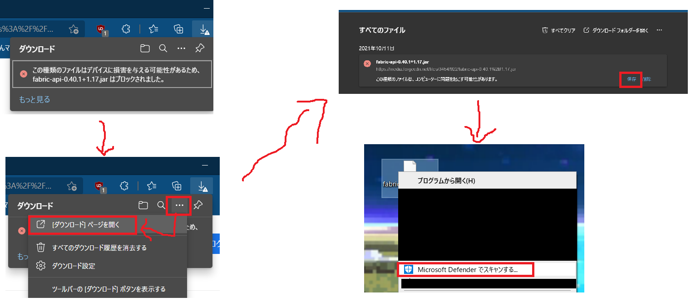
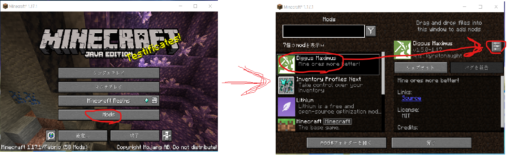
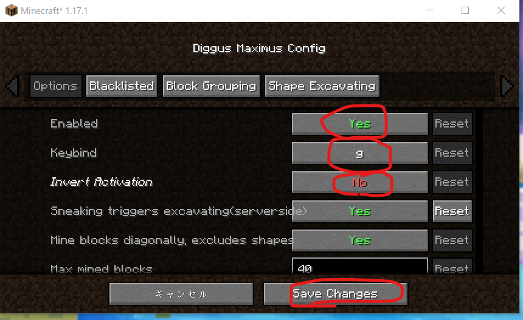

# マインクラフトサーバー(Java版)@animan鯖

- [マインクラフトサーバー(Java版)@animan鯖](#マインクラフトサーバーjava版animan鯖)
  - [はじめに](#はじめに)
  - [注意](#注意)
  - [禁止事項](#禁止事項)
  - [接続先サーバーアドレス](#接続先サーバーアドレス)
    - [現在の接続先サーバーアドレス](#現在の接続先サーバーアドレス)
    - [次回の接続先サーバーアドレス更新予定](#次回の接続先サーバーアドレス更新予定)
  - [本スレ](#本スレ)
  - [プレイに必要な環境](#プレイに必要な環境)
    - [前提](#前提)
    - [必須MOD](#必須mod)
    - [あると便利MOD](#あると便利mod)
    - [その他のMod](#その他のmod)
    - [セキュリティ警告が出てダウンロードできないとき](#セキュリティ警告が出てダウンロードできないとき)
    - [Diggus Maximus(一括破壊MOD)設定](#diggus-maximus一括破壊mod設定)
  - [Q&A](#qa)
    - [サーバーに繋がらない](#サーバーに繋がらない)
    - [サーバーには繋がったけど落下し続けてプレイできない](#サーバーには繋がったけど落下し続けてプレイできない)
    - [MODってセキュリティ的に大丈夫なの？](#modってセキュリティ的に大丈夫なの)
    - [バックアップってとってるの？](#バックアップってとってるの)
    - [超大作を作り上げたので定時バックアップを待たずにバックアップしてほしい](#超大作を作り上げたので定時バックアップを待たずにバックアップしてほしい)
    - [自分の建築物を壊されてしまった](#自分の建築物を壊されてしまった)
    - [このMOD使える？使っていい？](#このmod使える使っていい)
    - [ワールドのシード値が知りたい](#ワールドのシード値が知りたい)
    - [サーバー構築で使ってる技術について質問していい？/私もサーバー立ててみたい！](#サーバー構築で使ってる技術について質問していい私もサーバー立ててみたい)

## はじめに

「マイクラで遊んでやってもいいぞ」と思ってきてくださった方、ありがとうございます！

参加希望の方はこのページを**全て**読んでください。

面倒くさいと思われるかもしれませんが、接続するための情報以外にも大切なことが書いてあります。

## 注意

- 本コンテンツは[あにまんch](https://animanch.com/)公式とは一切関係がありません
- 本コンテンツはあくまでお遊びであり常に一定の動作を保障するものではありません
- **本コンテンツを利用することによって不利益などを被っても管理人は一切の責任を負いかねますのでご了承ください**
- **参加者の快適なプレイのため、公序良俗に乗っ取ったプレイを心掛けてください。マナーを守って楽しくマイクラ！**
- 牛などのMOBを過剰に増やすとサーバー負荷に繋がります。
    - 禁止ではありませんがむやみやたらに増やすことはせず、必要なだけ増やして増えすぎたらコントロールしましょう

なるべく多くの方が快適にプレイできるよう考えてプレイしていただければ幸いです。

## 禁止事項

以下のような行動をとったプレイヤーは管理者権限でブロックする可能性があります

- 他プレイヤーを不快にさせる行為全般
    - 一般常識の範囲でお願いします
- サーバーに意図して過剰な負荷をかける行為
    - 不安ならスレで管理人に相談してください

## 接続先サーバーアドレス

IBM Cloud k8s(無料枠)の制約上、約1カ月ごとにアドレスが変わります。ご注意ください。

接続前に[注意](#注意)、[禁止事項](#禁止事項)をよくご確認の上、[プレイに必要な環境](#プレイに必要な環境)が整っているか確認してください。

### 現在の接続先サーバーアドレス

|サーバーアドレス|
|----|
|169.51.203.7きゅう:3006ご|

ひらがなは数字に置き換えてください(念のための攻撃対策です)

### 次回の接続先サーバーアドレス更新予定

2021/11/26

## 本スレ

- 現行スレ(基本的になにかあればこちらに
  - https://bbs.animanch.com/board/93327/
- 過去スレ
  - https://bbs.animanch.com/board/74203/

## プレイに必要な環境

セキュリティ警告が出てMODがダウンロードできないときは[こちら](#セキュリティ警告が出てダウンロードできないとき)を参考にしてください。

### 前提

- Fabric 1.17.1
    - Fabric用MODを使うための前提環境
    - ガイドは[こちら](http://mechakurahome.com/2021/07/08/1-17-fabric/)

### 必須MOD

| MOD名      | 概要                           | DLリンク | 
| :--------- | ------------------------------ | -------- | 
| Fabric API | Fabric用MODを使うための前提MOD | [DL](https://media.forgecdn.net/files/3494/349/fabric-api-0.41.0%2B1.17.jar) | 

### あると便利MOD

| MOD名                   | 概要                                                                                 | DLリンク | 
| :---------------------- | ------------------------------------------------------------------------------------ | -------- | 
| ModMenu                 | Modの設定をマイクラ側から変更できるようになる                                        | [DL](https://media.forgecdn.net/files/3472/548/modmenu-2.0.13.jar)   | 
| Lithium                 | マイクラ全般の処理を改善する                                                         | [DL](https://media.forgecdn.net/files/3438/799/lithium-fabric-mc1.17.1-0.7.4.jar)   | 
| Sodium                  | マイクラの描画処理を劇的に改善する。リンク先の～.jarをDL                                                   | [DL](https://github.com/CaffeineMC/sodium-fabric/releases/tag/mc1.17.1-0.3.2)   | 
| Inventory Profiles Next | インベントリに整列(ソート)ボタンなどを追加する                                       | [DL](https://media.forgecdn.net/files/3477/726/InventoryProfilesNext-fabric-1.17-1.0.3.jar)   | 
| VoxelMap                | 画面上に周囲マップを描画する                                                         | [DL](https://media.forgecdn.net/files/3345/206/fabricmod_VoxelMap-1.10.15_for_1.17.0.jar)   | 
| Diggus Maximus          | 原木や鉱石などを一括で破壊できるようになる。初期状態だと何でも一括破壊するので[要設定](#diggus-maximus一括破壊mod設定) | [DL](https://media.forgecdn.net/files/3487/588/diggusmaximus-1.5.1-1.17.jar)   | 

### その他のMod

- 基本的に未検証
- クライアントサイドMODなら動作するハズだがサーバーに負荷がかかりそうなのはやめてね
- 気になるものがあれば検証するので本スレで管理人に教えてください

### セキュリティ警告が出てダウンロードできないとき

お使いの環境によってはセキュリティ警告が出てDLできない場合があります。

その場合は以下の画像のように操作してください。(ブラウザがEdgeの場合)

最後のステップではウイルススキャンをかけています。ここもお使いの環境に合わせて変えてください。

### Diggus Maximus(一括破壊MOD)設定

そのままでは使いにくいので設定をしておくと良いです。(要ModMenu導入)

マイクラのトップ画面から`MOD`をクリックし、左側で`Diggus Maximus`が選択されていることを確認してから右側の設定ボタンをクリックします。

- 以下のように設定します
- `Enable`を`Yes`に(おそらくデフォルトのまま)
- `Keybind`を`g`に(クリックした後`g`キー)
- `Invert Activation`を`No`に

全て選択し終えたら画面下側にある`Save Changes`をクリックして保存します。

これで`g`キーを押している間のみ一括破壊が有効になります。

## Q&A

### サーバーに繋がらない

[現在の接続先サーバーアドレス](#現在の接続先サーバーアドレス)と一致しているかよく確認してください。

アドレスは30日周期で変わります。もし30日過ぎてもページのアドレスが変わっていない時はブラウザのキャッシュが影響して古いページを見ているかもしれません。ブラウザのキャッシュを削除したあとに再度確認してみてください。

### サーバーには繋がったけど落下し続けてプレイできない

一度にプレイしている人数が多く、サーバー負荷が高い状態だとそのような現象が起きる可能性があるようです。時間を改めて接続してみてください。

現状、5,6人であれば問題なくプレイできるハズ...

明らかに人数が少ないのに問題が解決しない場合はスレで管理人に教えてください。

### MODってセキュリティ的に大丈夫なの？

一応上に書いているものは管理者が`Windwos Defender`セキュリティスキャンをかけて大丈夫だったものですが、何かあっても責任は全く取れません。

自己責任でお願いします。

### バックアップってとってるの？

毎日午前3時に自動バックアップを実行しています。

とりあえず今は正常に実行できている模様。

### 超大作を作り上げたので定時バックアップを待たずにバックアップしてほしい

スレで管理人に相談してください。

### 自分の建築物を壊されてしまった

原則諦めてもらうほかないですが、それが多くのプレイヤーの不利益に繋がる場合はバックアップから復元します。

管理人に相談してください。

### このMOD使える？使っていい？

クライアントサイドMODなら基本問題なく使えるハズですが、サーバーに負荷がかかりそうなものは遠慮してください。

不安ならスレで管理人に教えてください。検証します。

サーバーにも導入が必要なMODはサーバー再起動の必要があるため、管理人に相談してください。

### ワールドのシード値が知りたい

一応チートにあたるため折り畳み(クリックして展開)

<code>
4686960676118205869
</code>　

### サーバー構築で使ってる技術について質問していい？/私もサーバー立ててみたい！

素晴らしい！応援します。

基本的な構築手順はスレに上げていますが、その他コードなど詳しく知りたい場合はスレで管理人に教えてください。

